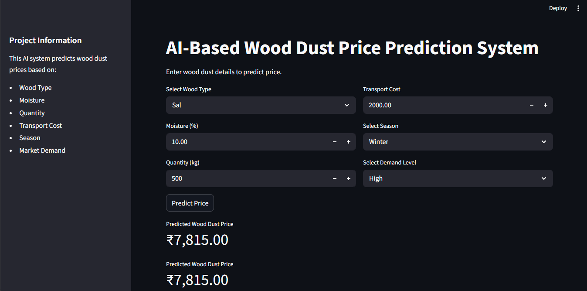
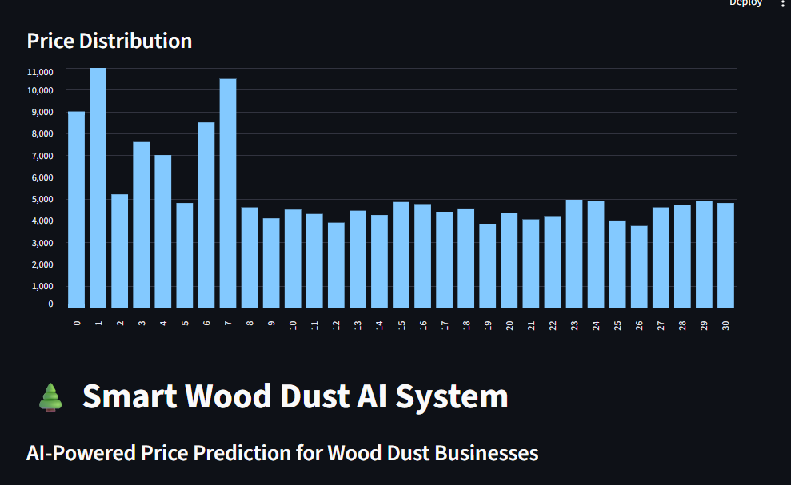

# 🌲 AI-Based Wood Dust Price Prediction System

An AI-powered Machine Learning web application that predicts wood dust prices using multiple business and environmental factors.

---

## 📌 Project Overview

This system predicts wood dust prices based on:

- Wood Type
- Moisture Level
- Quantity
- Transport Cost
- Season
- Market Demand

The project helps simulate real-world business price prediction using Machine Learning.

---

## 🚀 Features

```text
✔ AI-powered price prediction
✔ Interactive Streamlit dashboard
✔ Business insight generation
✔ Data visualization
✔ Machine Learning model training
✔ Real-time prediction system
✔ Clean UI dashboard
```

---

## 🛠 Technologies Used

```text
Python
Pandas
NumPy
Scikit-learn
Streamlit
Joblib
Matplotlib
Machine Learning
```

---

## 🤖 Machine Learning Model

```text
Model Used:
Random Forest Regressor
```

The model was trained using historical wood dust pricing data.

---

## 📊 Workflow

```text
Dataset
   ↓
Data Preprocessing
   ↓
Feature Encoding
   ↓
Model Training
   ↓
Prediction System
   ↓
Streamlit Web App
   ↓
Deployment
```

---

## ▶ Run Locally

### 1️⃣ Install Requirements

```bash
pip install -r requirements.txt
```

### 2️⃣ Run Streamlit App

```bash
streamlit run app/app.py
```

---

## 📁 Project Structure

```text
wood-dust-price-predictor/
│
├── app/
│   └── app.py
│
├── data/
│   └── wood_dust_data.csv
│
├── models/
│   └── model.pkl
│
├── src/
│   ├── preprocess.py
│   ├── train.py
│   └── predict.py
│
├── screenshots/
│
├── requirements.txt
├── README.md
└── .gitignore
```

---

## 📸 Screenshots

### Homepage


### Prediction Dashboard


### Analytics Section


---

## 🔮 Future Improvements

```text
- Live market data integration
- SQL database integration
- User authentication system
- Advanced analytics dashboard
- Demand forecasting
- Supplier recommendation system
- Cloud deployment
```

---

## 👩‍💻 Developer

Developed by Ankita Debnath  
BTech CSE (AI & ML)

---
